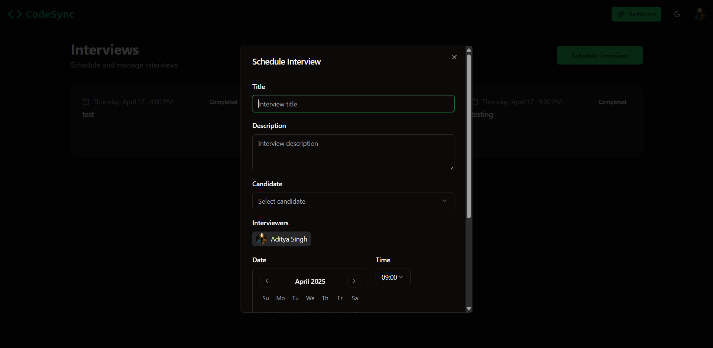
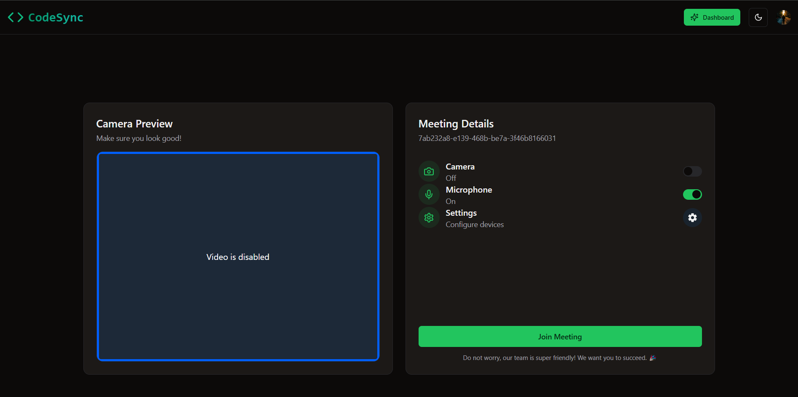
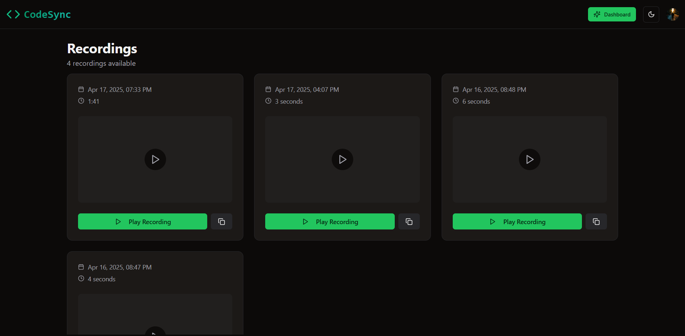

# 🔄 CodeSync – Collaborative Code Playground

A real‑time, multi‑language online code editor built for seamless collaboration. Write, execute, and share code with your team—complete with live syncing, theming, and integrated authentication.

---

## 📺 Live Demo

  
  
  
  
  

---

## 🚀 Highlights

- **Tech Stack**  
  Next.js · TypeScript · Convex · Clerk · Tailwind CSS · Recharts  
- **Real‑Time Sync**  
  Instant code sharing across multiple users  
- **Multi‑Language**  
  Supports JavaScript, Python, Java, C++ (and more)  
- **VSCode‑Style Themes**  
  Choose from Dark, Light, and Monokai themes  
- **Execution & Output**  
  Run code in‑browser with clear success/error feedback  
- **User Profiles**  
  Track history, save snippets, and personalize settings  
- **Interactive Charts**  
  Visualize usage stats with Recharts  
- **Secure Auth**  
  Clerk‑powered sign‑in/sign‑up and role‑based access  

---

## 🔧 Setup

1. **Clone & install**  
   ```bash
   git clone https://github.com/aditya03singh2003/CodeSync.git
   cd CodeSync
   npm install


Environment variables
Create a .env.local in the project root:

ini
Copy
Edit
NEXT_PUBLIC_CLERK_PUBLISHABLE_KEY=your_clerk_publishable_key
CLERK_SECRET_KEY=your_clerk_secret_key
CONVEX_DEPLOYMENT=your_convex_deployment
NEXT_PUBLIC_CONVEX_URL=your_convex_url
Run the dev server

bash
Copy
Edit
npm run dev
Open your browser
Navigate to http://localhost:3000.

🛠️ Features

Feature	Description
👥 Live Collaboration	Real‑time code sync powered by Convex
📝 Multi‑Language	JavaScript, Python, Java, C++
🎨 Theming	Dark, Light, Monokai with Tailwind & shadcn/ui
▶️ Code Execution	In‑browser runner with clear output & error states
📂 Snippet Library	Save, share, and search your code snippets
📊 Usage Dashboard	Visualize runs, users, and errors with Recharts
🔒 Secure Auth	Clerk authentication & session management
🤝 Contributing
Fork the repo

Create a branch

bash
Copy
Edit
git checkout -b feature/awesome
Commit your changes

bash
Copy
Edit
git commit -m 'feat: add awesome feature'
Push & open a PR

bash
Copy
Edit
git push origin feature/awesome
We’ll review & merge!

📄 License
This project is licensed under the MIT License. See LICENSE for details.

📫 Contact
Email: aditya03singh2003@gmail.com

LinkedIn: linkedin.com/in/adityaaa03

GitHub: github.com/aditya03singh2003

Happy coding! 🚀