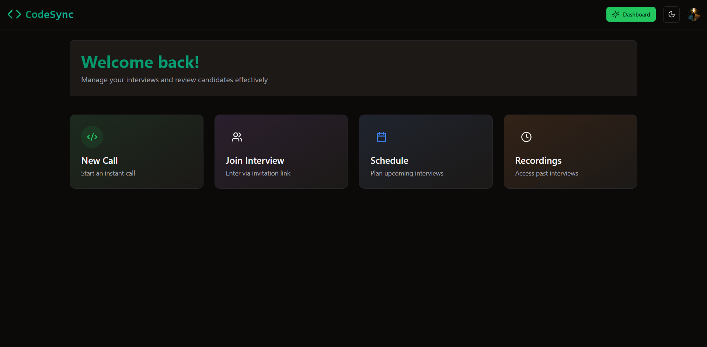

# CodeSync  
A fully‑featured remote interview platform built with cutting‑edge web technologies, empowering teams to conduct seamless, end‑to‑end technical interviews. With high‑quality video calls, real‑time screen sharing, and built‑in recording, interviewers and candidates can collaborate effortlessly. Under the hood, it leverages Next.js & TypeScript for fast, server‑rendered pages and dynamic routing, Stream for reliable media streams, Convex for real‑time state sync, and Clerk for secure authentication. Architected with modern Server and Client Components, Layouts, and Server Actions, and styled using Tailwind CSS and Shadcn/ui, it delivers a polished, responsive experience—ideal for both onsite and remote hiring workflows.


## 🚀 Live Demo

Access the deployed version here:  
🔗 [https://code-sync-eight-xi.vercel.app](https://code-sync-eight-xi.vercel.app)


## 🔥 Preview

### 🏠 Home Page


### 📅 Schedule Interview


### 🔗 Join Meeting


### 💻 Meeting Room


### 🎬 Recording


## 🚀 Highlights

- **Tech Stack:** Next.js & TypeScript, Stream, Convex, Clerk  
- **🎥 Video Calls**  
- **🖥️ Screen Sharing**  
- **🎬 Screen Recording**  
- **🔒 Authentication & Authorization**  
- **💻 Server Components, Layouts, Server Actions**  
- **🎭 Client & Server Components**  
- **🛣️ Dynamic & Static Routes**  
- **🎨 Styling with Tailwind & Shadcn**  
- **✨ Server Actions**

**Setup**  
1. Create `.env.local`:  
```ini
NEXT_PUBLIC_CLERK_PUBLISHABLE_KEY=your_key
CLERK_SECRET_KEY=your_secret
CONVEX_DEPLOYMENT=your_deployment
NEXT_PUBLIC_CONVEX_URL=your_url
```  
2. Install & run:  
```bash
git clone https://github.com/aditya03singh2003/CodeSync.git
cd CodeSync
npm install
npm run dev
```  
Open http://localhost:3000  

**Contribute**  
1. Fork repo  
2. Create feature branch  
3. Commit changes  
4. Open PR  

  
📫 **Contact**

Email: aditya03singh2003@gmail.com

LinkedIn: linkedin.com/in/adityaaa03

GitHub: github.com/aditya03singh2003

